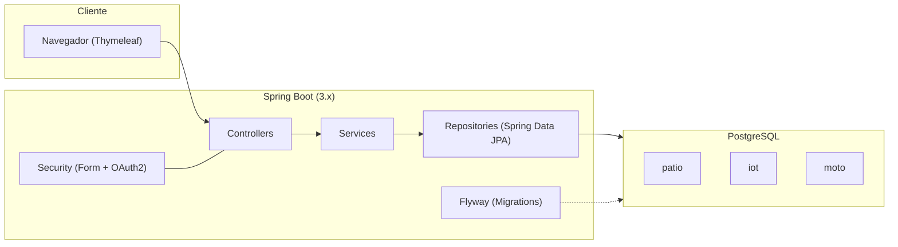
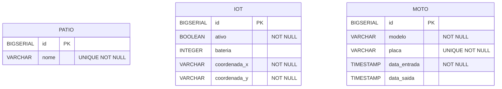

# 🧪 TechLab — Sistema de Gerenciamento de Pátios, IoT e Motos

Aplicação **web** (Thymeleaf) construída em **Spring Boot 3** para administrar pátios, dispositivos **IoT** e **motos**, com autenticação (OAuth2 + formulário), **dashboard** e UI dark usando **TailwindCSS** (CDN).

> Este README substitui o antigo “Patio Vision” — todo o projeto passou a se chamar **TechLab**.

---

## 👥 Integrantes

- **Davi Alves de Lima** — RM 556008  
- **Pedro Henrique Mendonça de Novais** — RM 555276  
- **Rodrigo Alcides Bohac Ríos** — RM 554826  

---

## 📦 Estrutura do Projeto

- **Build**: Gradle (Java 17)  
- **Main class**: `com.techlab.Application`  
- **View engine**: Thymeleaf  
- **UI**: TailwindCSS via CDN (ver `templates/fragments/header.html`)  
- **Banco**: PostgreSQL (Flyway para migrações)  
- **Auth**: Spring Security (Form login + OAuth2 GitHub/Google)  

Alguns pacotes principais (em `src/main/java/com/techlab/`):

```
config/                 # Segurança (SecurityConfiguration)
dashboard/              # Dashboard (KPIs)
iot/                    # CRUD de IoT (Iot, IotController, IotRepository, IotService, IotDTO)
moto/                   # CRUD de Moto (Moto, MotoController, MotoRepository, MotoService, MotoDTO)
patio/                  # CRUD de Pátio (Patio, PatioController, PatioRepository, PatioService, PatioDTO)
auth/                   # Login, Logout, Registro
user/                   # Endpoint para dados do usuário logado
sensor/, antenna/       # POC/Extras: sensores RFID e situações de antena
helper/                 # BaseController e utilidades
```

Templates (em `src/main/resources/templates/`): `index.html`, `login.html`, `logout.html`, `register.html`, pastas `patio/`, `iot/`, `moto/`, etc.  
Migrações Flyway (em `src/main/resources/db/migration/`): `V2__create_table_patio.sql`, `V3__create_table_iot.sql`, `V4__create_table_moto.sql` (entre outras).

---

## 🔧 Tecnologias

- **Spring Boot 3.5.4**
- Spring MVC, Spring Security, Spring Data JPA
- **Thymeleaf**
- **TailwindCSS** (CDN)
- **PostgreSQL** + **Flyway**
- **Lombok**
- Dockerfile (build de imagem com JDK 17)

---

## 🚀 Como Rodar

### Pré‑requisitos
- **Java 17+**
- **PostgreSQL** acessível (local ou remoto)
- **Gradle** (wrapper incluso: `./gradlew`)

### 1) Configurar Banco
Crie um banco (ex.: `tech_lab`) e um usuário com permissão. Exemplo SQL:

```sql
CREATE DATABASE tech_lab;
CREATE USER techlab WITH ENCRYPTED PASSWORD 'techlab';
GRANT ALL PRIVILEGES ON DATABASE tech_lab TO techlab;
```

### 2) Configurar variáveis de ambiente (opcional para OAuth2)
No modo **dev** o app inicia sem datasource explícito. Para **produção** ou se desejar OAuth2:

```properties
# application-prod.properties (usado quando ACTIVE_PROFILE=prod)
DB_URL=jdbc:postgresql://localhost:5432/tech_lab
DB_USER=techlab
DB_PASS=techlab

# OAuth2 (opcional)
GITHUB_CLIENT_ID=xxxxx
GITHUB_CLIENT_SECRET=xxxxx
GOOGLE_CLIENT_ID=xxxxx
GOOGLE_CLIENT_SECRET=xxxxx
```

> O perfil ativo é definido por `ACTIVE_PROFILE` (padrão: `dev`). No `dev` as migrações do Flyway são procuradas em `classpath:db/migration,classpath:db/migration-dev` (ver `application.properties`).

### 3) Subir a aplicação

```bash
# Linux/Mac
./gradlew bootRun

# Windows
gradlew.bat bootRun
```

Acesse **http://localhost:8080**.

### 4) Build de JAR
```bash
./gradlew bootJar
java -jar build/libs/*.jar
```

### 5) Docker (opcional)
Uma imagem pode ser gerada usando o `Dockerfile` incluso:

```bash
docker build -t techlab:latest .
docker run -p 8080:8080 --name techlab   -e ACTIVE_PROFILE=prod   -e DB_URL=jdbc:postgresql://host.docker.internal:5432/tech_lab   -e DB_USER=techlab -e DB_PASS=techlab   techlab:latest
```

---

## 🗂️ Banco de Dados (modelo atual)

Tabelas principais mantidas pelo projeto:

```sql
-- patio
CREATE TABLE patio (
    id   BIGSERIAL PRIMARY KEY,
    nome VARCHAR(255) NOT NULL UNIQUE
);

-- iot
CREATE TABLE iot (
    id            BIGSERIAL PRIMARY KEY,
    ativo         BOOLEAN NOT NULL,
    bateria       INTEGER,
    coordenada_x  VARCHAR(255) NOT NULL,
    coordenada_y  VARCHAR(255) NOT NULL
);

-- moto
CREATE TABLE moto (
    id            BIGSERIAL PRIMARY KEY,
    modelo        VARCHAR(255) NOT NULL,
    placa         VARCHAR(255) NOT NULL UNIQUE,
    data_entrada  TIMESTAMP NOT NULL,
    data_saida    TIMESTAMP
);
```

> Observação: o domínio **não** utiliza mais “Setor”. IoT, Moto e Pátio são gerenciados de forma independente.

---

## 🌐 Rotas Principais (Web)

### Autenticação
- `GET /login` — página de login  
- `GET /register` — cadastro de usuário; `POST /register` cria o usuário  
- `POST /logout` — encerra sessão  
- OAuth2: `GET /oauth2/authorization/github` e `GET /oauth2/authorization/google`

### Dashboard
- `GET /` — redirect / home
- `GET /index` — KPIs de Pátios, IoTs e Motos

### Pátio
- `GET /patio` — listar
- `GET /patio/form` — formulário
- `POST /patio/form` — criar/atualizar (envia `id` para editar)
- `GET /patio/<id>/edit` — editar
- `POST /patio/<id>/delete` — excluir

### IoT
- `GET /iot` — listar
- `GET /iot/form` — formulário
- `POST /iot/form` — criar/atualizar
- `GET /iot/<id>/edit` — editar
- `POST /iot/<id>/delete` — excluir

### Moto
- `GET /moto` — listar
- `GET /moto/form` — formulário
- `POST /moto/form` — criar/atualizar
- `GET /moto/<id>/edit` — editar
- `POST /moto/<id>/delete` — excluir

> Extras presentes no repositório: **RFID Sensors** (`/sensor`), **Antenna Situations** (`/antenas`) — POCs/administrativas.

---

## 🎨 UI / Padrão Visual

- Tema **dark** com **TailwindCSS** via CDN (Inter como font)  
- Componentização de **navbar** e **footer** em `templates/fragments/`  
- Páginas seguem o padrão: **bgs** `gray-900/800`, **borders** `gray-700`, **primárias** `green-600/700`, **destaques** `cyan-500`  

---

## 🔐 Segurança

- Spring Security com **form login** e **OAuth2** (GitHub/Google).  
- `SecurityConfiguration` define regras públicas/privadas e provedor com **BCrypt**.  
- CSRF habilitado e utilizado nos formulários (`_csrf`).

---

## 🧭 Roadmap / Ideias Futuras

- Integração em tempo real (WebSocket) para status de IoT
- KPIs com gráficos e filtros avançados
- Testes E2E (Selenium/Selenide) e Contract Tests

---

## 📄 Licença

Projeto acadêmico — FIAP. Uso educacional.
---

## 📐 Diagramas Mermaid (atualizado em 01/10/2025)

### Arquitetura da solução



### Estrutura de dados (ER)



---

## 🗄️ DDL completo (criação de tabelas e FKs)
> Extraído automaticamente das migrations Flyway em `src/main/resources/db/migration/`.

```sql
-- V1__create_table_task.sql
CREATE TABLE task
(
    id          BIGINT GENERATED BY DEFAULT AS IDENTITY NOT NULL,
    title       VARCHAR(255),
    description VARCHAR(255),
    score       INTEGER                                 NOT NULL,
    status      INTEGER                                 NOT NULL,
    CONSTRAINT pk_task PRIMARY KEY (id)
);

-- V1__create_table_user.sql
CREATE TABLE techlabuser
(
    id         BIGINT GENERATED BY DEFAULT AS IDENTITY NOT NULL,
    email      VARCHAR(255),
    name       VARCHAR(255),
    avatar_url VARCHAR(255),
    password VARCHAR(255),
    CONSTRAINT pk_techlabuser PRIMARY KEY (id)
);

-- V1__create_tables.sql
CREATE TABLE task
(
    id          BIGINT GENERATED BY DEFAULT AS IDENTITY NOT NULL,
    title       VARCHAR(255),
    description VARCHAR(255),
    score       INTEGER                                 NOT NULL,
    status      INTEGER                                 NOT NULL,
    CONSTRAINT pk_task PRIMARY KEY (id)
);

-- V1__init_schema.sql
CREATE TABLE IF NOT EXISTS users (
    id BIGSERIAL PRIMARY KEY,
    username VARCHAR(100) UNIQUE NOT NULL,
    password VARCHAR(255) NOT NULL,
    enabled BOOLEAN NOT NULL DEFAULT TRUE
);

-- V1__init_schema.sql
CREATE TABLE IF NOT EXISTS roles (
    id BIGSERIAL PRIMARY KEY,
    name VARCHAR(50) UNIQUE NOT NULL
);

-- V1__init_schema.sql
CREATE TABLE IF NOT EXISTS user_roles (
    user_id BIGINT NOT NULL REFERENCES users(id) ON DELETE CASCADE,
    role_id BIGINT NOT NULL REFERENCES roles(id) ON DELETE CASCADE,
    PRIMARY KEY (user_id, role_id)
);

-- V1__init_schema.sql
CREATE TABLE IF NOT EXISTS motos (
    id BIGSERIAL PRIMARY KEY,
    placa VARCHAR(20) UNIQUE NOT NULL,
    modelo VARCHAR(100) NOT NULL,
    ano INT,
    status VARCHAR(30) NOT NULL DEFAULT 'ATIVA'
);

-- V1__init_schema.sql
CREATE TABLE IF NOT EXISTS rfid_sensors (
    id BIGSERIAL PRIMARY KEY,
    epc VARCHAR(128) UNIQUE NOT NULL,
    ativo BOOLEAN NOT NULL DEFAULT TRUE,
    moto_id BIGINT REFERENCES motos(id) ON DELETE SET NULL
);

-- V1__init_schema.sql
CREATE TABLE IF NOT EXISTS antenna_situations (
    id BIGSERIAL PRIMARY KEY,
    antena_id VARCHAR(64) NOT NULL,
    localizacao VARCHAR(120),
    situacao VARCHAR(64) NOT NULL,
    data_registro TIMESTAMP NOT NULL DEFAULT NOW()
);

-- V2__create_table_patio.sql
CREATE TABLE patio (
    id BIGSERIAL PRIMARY KEY,
    nome VARCHAR(255) NOT NULL UNIQUE
);

-- V2__create_table_user.sql
CREATE TABLE epicuser
(
    id         BIGINT GENERATED BY DEFAULT AS IDENTITY NOT NULL,
    name       VARCHAR(255),
    email      VARCHAR(255),
    avatar_url VARCHAR(255),
    CONSTRAINT pk_epicuser PRIMARY KEY (id)
);

-- V3__add_fk_task_user.sql
ALTER TABLE task
    ADD CONSTRAINT FK_TASK_ON_USER FOREIGN KEY (user_id) REFERENCES epicuser (id);

-- V3__create_table_iot.sql
create table iot (
    id           bigserial primary key,
    ativo        boolean not null,
    bateria      integer,
    coordenada_x varchar(255) not null,
    coordenada_y varchar(255) not null
);

-- V4__create_table_moto.sql
create table moto (
    id           bigserial primary key,
    modelo       varchar(255) not null,
    placa        varchar(255) not null unique,
    data_entrada timestamp not null,
    data_saida   timestamp
);

-- V5__create_table_moto.sql
CREATE TABLE moto(
    id BIGINT GENERATED BY DEFAULT AS IDENTITY PRIMARY KEY,
    placa VARCHAR(20) NOT NULL,
    modelo VARCHAR(80) NOT NULL,
    ano INTEGER,
    status VARCHAR(30) NOT NULL
);

-- V6__create_table_rfid_sensor.sql
CREATE TABLE rfid_sensor(
    id BIGINT GENERATED BY DEFAULT AS IDENTITY PRIMARY KEY,
    codigo VARCHAR(80) NOT NULL,
    ativo BOOLEAN NOT NULL DEFAULT TRUE,
    moto_id BIGINT,
    CONSTRAINT fk_sensor_moto FOREIGN KEY (moto_id) REFERENCES moto(id)
);

-- V7__create_table_antenna_situation.sql
CREATE TABLE antenna_situation(
    id BIGINT GENERATED BY DEFAULT AS IDENTITY PRIMARY KEY,
    antena_id VARCHAR(80) NOT NULL,
    localizacao VARCHAR(120),
    situacao VARCHAR(40) NOT NULL,
    data_registro TIMESTAMP
);
```
